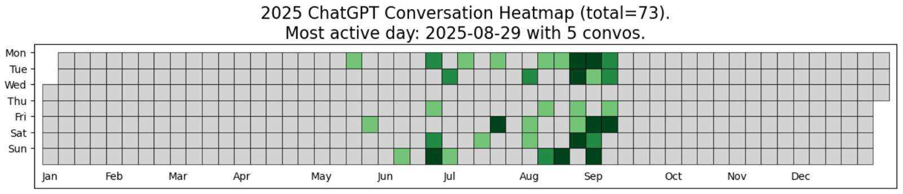

# ChatGPT and Claude Usage Visualization

📊 A data-driven exploration and visualization of ChatGPT and Claude usage patterns.  
This repository contains Jupyter notebook and scripts to process usage data, generate insights, and visualize trends with clear, intuitive plots.

---

## Features

- 🔎 **Data Processing**: Cleans and structures raw usage data.  
- 📈 **Interactive Visualizations**: Charts comparing ChatGPT and Claude usage over time.  
- 📊 **Insights Extraction**: Highlights peak usage, adoption trends, and shifts in preference.  
- 🐍 **Pythonic Workflow**: Implemented in Python with libraries like `pandas`, `matplotlib`, and `seaborn`.

---

## Example Visualizations

### ChatGPT usage

### ChatGPT vs Claude Usage Over Time

---

